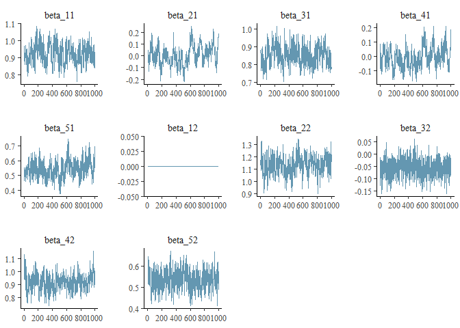
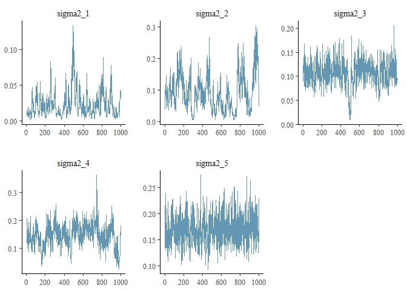
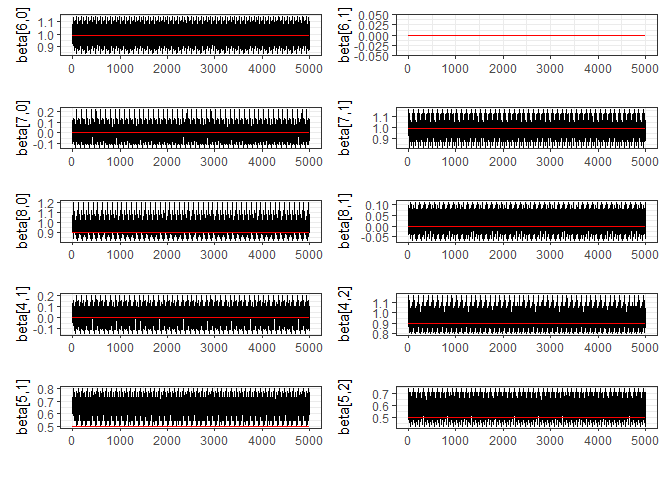
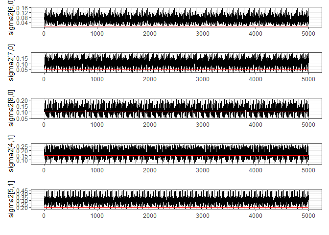
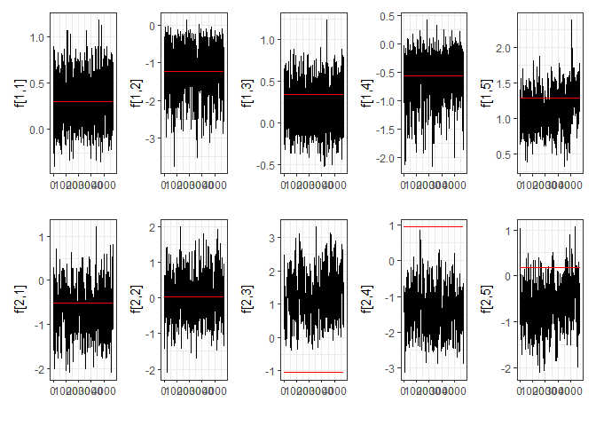
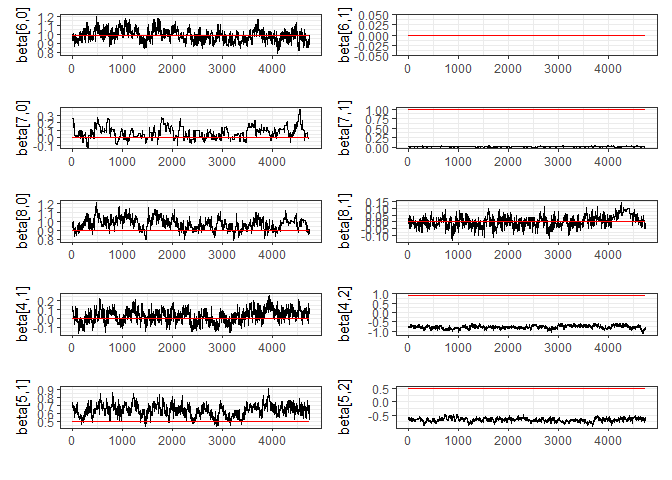
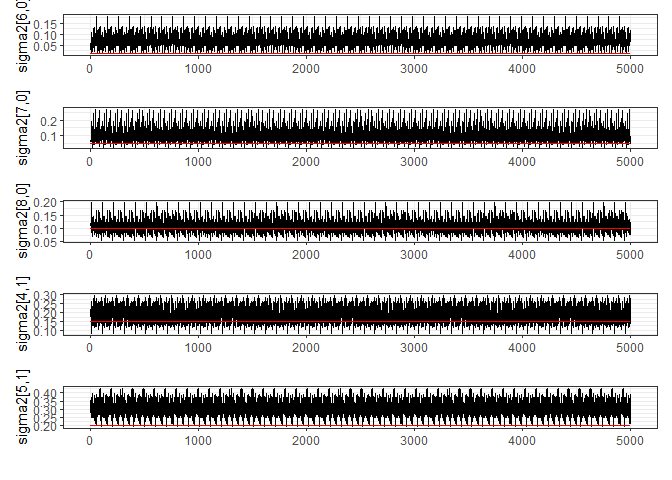

<!-- README.md is generated from README.Rmd. Please edit that file -->

# fatcat

<!-- badges: start -->
<!-- badges: end -->

Fit bayesian factor models for categorical data.

## Installation

You can install the development version of fatcat like so:

``` r
install.packages(remotes)
remotes::install_github("vitorcapdeville/fatcat")
```

## Example

This is a basic example which shows you how to solve a common problem:

``` r
library(fatcat)
#> Loading required package: RcppTN
# Genarate some fake data
j <- 5
n <- 300
k <- 4
true_p <- 2

true_beta <- matrix(
  c(
    0.99, 0.00,
    0.00, 0.99,
    0.90, 0.00,
    0.00, 0.90,
    0.50, 0.50
  ),
  nrow = j, ncol = true_p,
  byrow = TRUE
)

true_sigma <- c(0.01, 0.05, 0.10, 0.15, 0.20)

true_alfa <- matrix(
  c(-Inf, qnorm(0.4), qnorm(0.75), qnorm(0.9), Inf),
  nrow = j, ncol = (k + 1),
  byrow = TRUE
)

true_f <- t(
  MASS::mvrnorm(n, rep(0, true_p), diag(1, true_p, true_p))
)

y <- data_sim(true_beta, true_sigma, true_alfa, true_f, link = "probit")
```

Note that variables 1 and 3 are highly correlated. The same happens for
variables 2 and 4.

``` r
cor <- psych::polychoric(t(y))$rho
corrplot::corrplot(cor, type = "upper")
```



Fit the probit model to the simulated dataset.

``` r
res <- fitfatcat(y, p = 2, nit = 5000, dist = "probit")
#> Executado em 41.41 secs
```

``` r
plotfatcat(res, true_f, "f")
#> Plotting only res$f[,1:5,].
```



``` r
plotfatcat(res, true_beta, "beta")
```



``` r
plotfatcat(res, true_sigma, "sigma2")
```



Try the same, but with logit link function.

``` r
res <- fitfatcat(y, p = 2, nit = 5000, dist = "logit")
#> Executado em 37.91 secs
```

``` r
plotfatcat(res, true_f, "f")
#> Plotting only res$f[,1:5,].
```



``` r
plotfatcat(res, true_beta, "beta")
```



``` r
plotfatcat(res, true_sigma, "sigma2")
```


